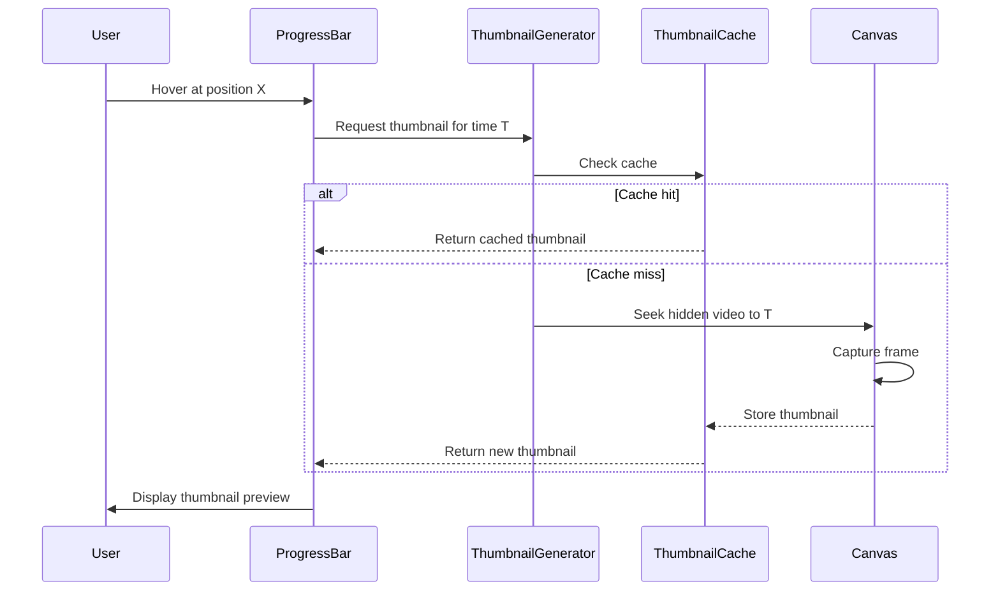

# Design Document

## Overview

Bu tasarım dokümanı, video player'ın iki önemli UI iyileştirmesini kapsar:
1. Play overlay'in daha sade ve modern bir tasarıma güncellenmesi
2. Progress bar üzerinde thumbnail preview özelliğinin eklenmesi

## Architecture

### Component Structure

```
VideoPlayer
├── video (main playback)
├── PlayOverlay (updated design)
├── VideoControls
│   ├── ProgressBar
│   │   ├── ProgressTrack
│   │   ├── ProgressFilled
│   │   ├── ProgressThumb
│   │   └── ThumbnailPreview (new)
│   └── ControlButtons
└── ThumbnailGenerator (hidden, for preview generation)
```

### Data Flow



## Components and Interfaces

### 1. Updated Play Overlay

```typescript
interface PlayOverlayProps {
  isVisible: boolean;
  onClick: () => void;
  accentColor?: string;
}

// Style constants
const PLAY_OVERLAY_STYLES = {
  // Simple dark overlay without blur
  background: 'rgba(0, 0, 0, 0.4)',
  
  // Play button - clean circle
  buttonSize: 64,
  buttonBackground: 'rgba(255, 255, 255, 0.95)',
  buttonIconColor: '#000',
  
  // Hover state
  hoverScale: 1.1,
  hoverBackground: 'rgba(255, 255, 255, 1)',
  
  // Transitions
  fadeTransition: '0.2s ease',
  scaleTransition: '0.15s ease',
};
```

### 2. Thumbnail Preview Component

```typescript
interface ThumbnailPreviewProps {
  videoSrc: string;
  time: number;
  position: number; // percentage (0-100)
  isVisible: boolean;
}

interface ThumbnailCache {
  [timeKey: string]: string; // time -> dataURL
}

// Configuration
const THUMBNAIL_CONFIG = {
  width: 160,
  height: 90, // 16:9 aspect ratio
  cacheSize: 50, // max cached thumbnails
  debounceMs: 100,
  quality: 0.7, // JPEG quality
};
```

### 3. Thumbnail Generator Hook

```typescript
interface UseThumbnailGeneratorOptions {
  videoSrc: string;
  enabled?: boolean;
}

interface UseThumbnailGeneratorReturn {
  getThumbnail: (time: number) => Promise<string | null>;
  isGenerating: boolean;
  clearCache: () => void;
}

function useThumbnailGenerator(options: UseThumbnailGeneratorOptions): UseThumbnailGeneratorReturn;
```

## Data Models

### Thumbnail Cache Entry

```typescript
interface ThumbnailCacheEntry {
  dataUrl: string;
  timestamp: number; // video time in seconds
  createdAt: number; // Date.now() for LRU eviction
}
```

### Preview State

```typescript
interface PreviewState {
  isVisible: boolean;
  time: number;
  position: number;
  thumbnailUrl: string | null;
  isLoading: boolean;
}
```

## Correctness Properties

*A property is a characteristic or behavior that should hold true across all valid executions of a system-essentially, a formal statement about what the system should do. Properties serve as the bridge between human-readable specifications and machine-verifiable correctness guarantees.*

### Property 1: Play Overlay Visibility Consistency

*For any* video state (playing or paused), the play overlay visibility SHALL be the inverse of the playing state - visible when paused, hidden when playing.

**Validates: Requirements 1.1**

### Property 2: Thumbnail Display and Positioning

*For any* hover position on the progress bar (0-100%), the thumbnail preview SHALL appear at the correct position and display the corresponding timestamp.

**Validates: Requirements 2.1, 2.2**

### Property 3: Thumbnail Aspect Ratio Invariant

*For any* generated thumbnail, the dimensions SHALL maintain a 16:9 aspect ratio (width/height = 1.78 ± 0.01).

**Validates: Requirements 2.8**

### Property 4: Thumbnail Cache Round-Trip

*For any* video time T, generating a thumbnail and then requesting the same time T again SHALL return the cached result without regeneration.

**Validates: Requirements 3.2**

### Property 5: Thumbnail Request Debouncing

*For any* sequence of rapid hover position changes (within debounce window), only the final position SHALL trigger thumbnail generation.

**Validates: Requirements 3.3**

### Property 6: Preview Position Bounds

*For any* thumbnail preview position, the preview element SHALL remain within the visible bounds of the video player container (no overflow).

**Validates: Requirements 2.2**

## Error Handling

### Thumbnail Generation Errors

1. **Video not loaded**: Show time tooltip only, no thumbnail
2. **CORS restrictions**: Gracefully degrade to time-only preview
3. **Canvas capture failure**: Log error, show time tooltip
4. **Memory pressure**: Clear oldest cache entries, continue with reduced cache

### Fallback Strategy

```typescript
const handleThumbnailError = (error: Error) => {
  console.warn('Thumbnail generation failed:', error.message);
  // Fallback: show only time tooltip
  setShowThumbnail(false);
  setShowTimeOnly(true);
};
```

## Testing Strategy

### Unit Tests

1. **Play Overlay**
   - Visibility toggle based on play state
   - Hover state changes
   - Click handler invocation

2. **Thumbnail Generator**
   - Cache hit/miss behavior
   - Debounce functionality
   - Error handling

3. **Preview Positioning**
   - Boundary calculations
   - Position clamping

### Property-Based Tests

1. **Thumbnail Cache Round-Trip**
   - Generate thumbnail → cache → retrieve → compare

2. **Position Calculation**
   - For all valid progress percentages, preview stays in bounds

### Integration Tests

1. **Full hover flow**: Hover → thumbnail appears → move → updates → leave → disappears
2. **Play overlay interaction**: Click overlay → video plays → overlay hides

## Implementation Notes

### Canvas Thumbnail Generation

```typescript
const generateThumbnail = async (
  video: HTMLVideoElement,
  time: number
): Promise<string> => {
  return new Promise((resolve, reject) => {
    const canvas = document.createElement('canvas');
    canvas.width = THUMBNAIL_CONFIG.width;
    canvas.height = THUMBNAIL_CONFIG.height;
    
    const ctx = canvas.getContext('2d');
    if (!ctx) {
      reject(new Error('Canvas context not available'));
      return;
    }
    
    // Use a cloned/hidden video to avoid affecting playback
    const hiddenVideo = video.cloneNode() as HTMLVideoElement;
    hiddenVideo.currentTime = time;
    
    hiddenVideo.onseeked = () => {
      ctx.drawImage(hiddenVideo, 0, 0, canvas.width, canvas.height);
      resolve(canvas.toDataURL('image/jpeg', THUMBNAIL_CONFIG.quality));
      hiddenVideo.remove();
    };
    
    hiddenVideo.onerror = () => {
      reject(new Error('Video seek failed'));
      hiddenVideo.remove();
    };
  });
};
```

### LRU Cache Implementation

```typescript
class ThumbnailLRUCache {
  private cache: Map<string, ThumbnailCacheEntry>;
  private maxSize: number;
  
  constructor(maxSize: number) {
    this.cache = new Map();
    this.maxSize = maxSize;
  }
  
  get(key: string): string | null {
    const entry = this.cache.get(key);
    if (entry) {
      // Move to end (most recently used)
      this.cache.delete(key);
      this.cache.set(key, { ...entry, createdAt: Date.now() });
      return entry.dataUrl;
    }
    return null;
  }
  
  set(key: string, dataUrl: string, timestamp: number): void {
    if (this.cache.size >= this.maxSize) {
      // Remove oldest entry
      const oldestKey = this.cache.keys().next().value;
      if (oldestKey) this.cache.delete(oldestKey);
    }
    this.cache.set(key, { dataUrl, timestamp, createdAt: Date.now() });
  }
  
  clear(): void {
    this.cache.clear();
  }
}
```
